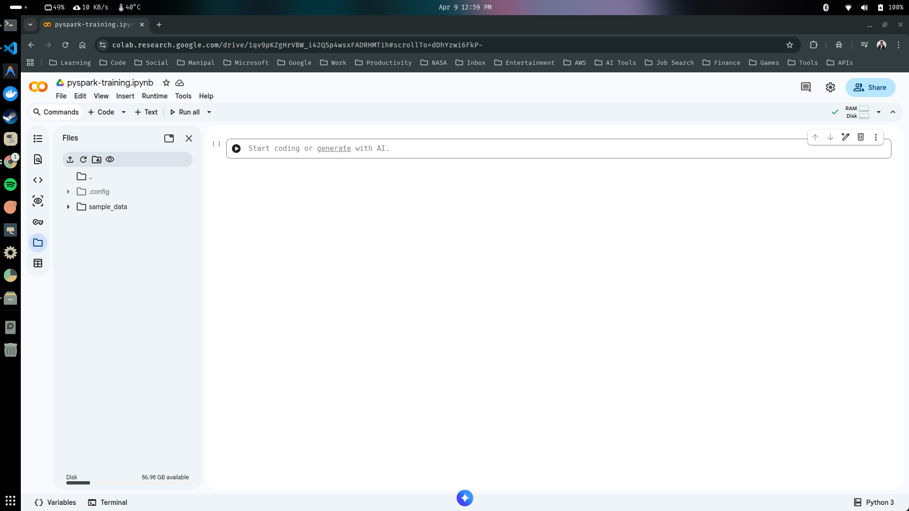

## Python Environment Setup

One of the easiest way to run PySpark is in a Jupyter Notebook, but setting up this on your local device can be time consuming as well as a bit frustrating. For the purpose of this course we are going to use a cloud-based development environment to make sure that we all use the same setup, regardless of operating system. 

Google Colab is a cloud-based notebook environment that functions similar to Jupyter Notebook in the sandbox python environment, therefore we don't have to worry about our local configuration. Its free and works in any browser.

Let's walkthrough a set up on how to run pyspark in a google colab notebook. 

1. In order to use google colab, you will need a google account (most of us already have an google account). If you don't have an google account go to the link below and create a new google account.

```text
https://account.google.com/
```

*With this account you can use various google services like google drive, gmail and colab.*

2. To setup your google colab go to the below link, and click on 'New notebook'.

```text
https://colab.research.google.com/
```

3. You can rename the notebook at the top where it says untitled, click into the field and name it 'pyspark-training'.



*If you're familiar with Jupyter Notebooks, Colab works just like that. You can type python code into the code boxes and execute it by clicking the play button*

4. Copy paste the below code to the cell box and execute using the play button.

```python
## Cell 1

print("Hello World")
```
```text
Hello World
```

*Google Colab might not come with PySpark installed*

5. Ensure that pyspark library is available, type the following code into a notebook cell and execute it.

```python
## Cell 2

!pip install pyspark
```
```text
Requirement already satisfied: pyspark in /usr/local/lib/python3.12/dist-packages (4.0.2)
Requirement already satisfied: py4j<0.10.9.10,>=0.10.9.7 in /usr/local/lib/python3.12/dist-packages (from pyspark) (0.10.9.9)
```

6. Check the pyspark version.

```python
## Cell 3

import pyspark
pyspark.__version__
```
```text
4.0.2
```

> [!IMPORTANT]
> Keep in mind that a colab notebook will reset its memory, after its been idle for 90 minutes. This means that you might have to rerun all cells to reload the content if you've taken a longer break.

---

# <div align="center">Thank You for Going Through This Guide! 🙏✨</div>