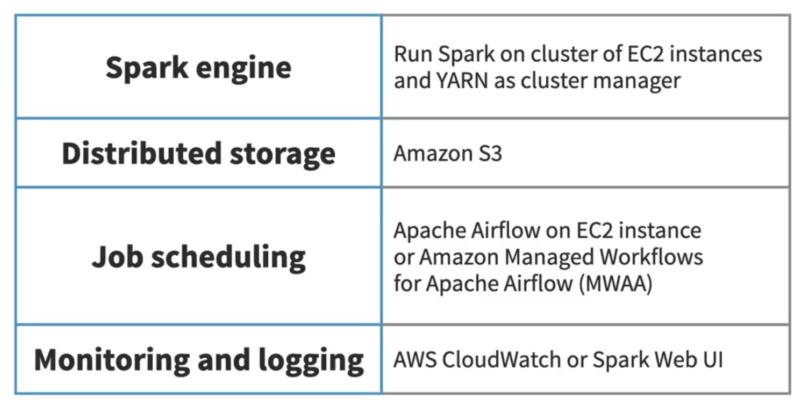
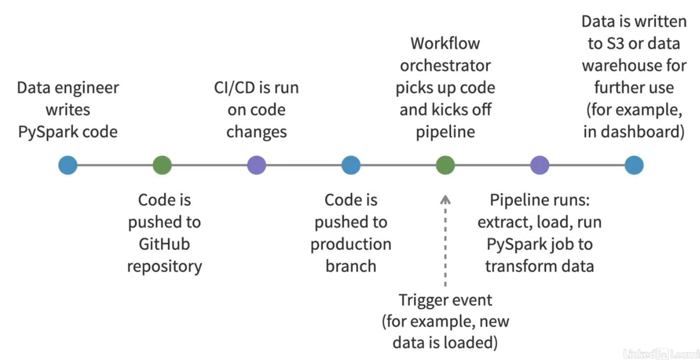
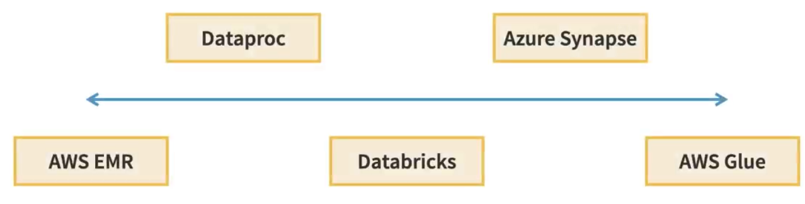

## Overview: PySpark in a Production Environment

In this chapter, you'll learn how PySpark is commonly used beyond our tutorial setup in real-world, production-grade environments that process massive datasets on a daily basis.

We'll cover:

- The requirements to run PySpark in a production environment
- An example of a typical production setup
- A common PySpark workflow in production
- Cloud-based services that support PySpark

---

### Production Environment Requirements

Running a pyspark data pipeline in production typically means working with large volumes of data, often across multiple servers or cloud instances, and making sure the entire system is scalable, reliable and secure. Unlike a local setup, production environment needs to handle failure gracefully, run jobs on a schedule, and support team collaboration. Here are some of the core components you'll find in a typical pyspark production setup:

- `Data Sources:` The most important part of any pipeline is the data itself. You're likely pulling from various sources such as operational databases, application logs, APIs, or flat files from vendors. 

- `Data Extraction:` To move that data into your storage layer, you might use data extraction tools like Fivetran, Airbyte, Kafka, AWS Kinesis, or custom scripts.

- `Distributed Storage:` Since you're working with large data sets, a single machine storage is not enough. Production environments use distributed storage systems like HDFS, Amazon S3, or Google Cloud Storage. These systems can scale horizontally and offer high availability.

- `Cluster management:` Spark runs on a cluster, which is a group of machines that work together to process data. You need a cluster manager to coordinate CPU, memory, and network usage across these machines. Common cluster managers include YARN and Kubernetes.

- `Job Scheduling:` A PySpark job is simply a piece of Python code that uses the PySpark API to process data. In production, jobs should run automatically instead of being started manually. Tools like Apache Airflow are commonly used to schedule and coordinate PySpark jobs.

- `Consistent environments:` When working with a team, it's important to make sure code runs the same way in development, testing, and production. This often means using Docker or virtual environments to keep dependencies consistent.

- `Monitoring and logging:` You need visibility into job performance and behavior. Tools like the Spark Web UI, Grafana dashboards, and cloud-native tools like AWS CloudWatch help track metrics and receive alerts.

- `Security and access control:` Security is essential to prevent unauthorized access and data leaks. This includes setting up IAM roles, network protections, encryption, and planning for disaster recovery.

> As you can see, there are many moving pieces when running PySpark in production, and all of these work together to create a highly performant and reliable system.

---

### Example: Production Environment Setup 

Let's look at a more concrete example of what running PySpark in production might look like.

For this example, I'm going to assume we're using Amazon Web Services, AWS, as our cloud provider. 

> Setup Basic Architecture:

In this setup, we're going to run Spark on a cluster of EC2 instances, and we'll use YARN as a cluster manager. That means you'll need to launch your own virtual machines using the EC2 service, install Spark and Hadoop, configure the nodes to talk to each other, and manage things like memory allocation and resource scheduling yourself.

For our distributed storage, we can simply use Amazon S3. You might already be familiar with S3. It's an object storage service in AWS that can store huge amounts of data reliably and cheaply. In this setup, your PySpark job reads data files directly from S3, processes them, and then writes the results back to S3. PySpark supports S3 natively, so it's really easy to integrate. You just provide the S3 path in your read or write functions.

Next, we need to run jobs automatically. That's where a workflow scheduler like Apache Airflow comes in. Airflow is often used to run PySpark jobs on a schedule, say, once every hour or at midnight every day. You define the pipelines to run in Python, and Airflow handles triggering them, tracking their status, retrying them if they fail, and even notifying your team if something goes wrong. In AWS, Airflow can be self-hosted on EC2 or Kubernetes, or you can use Amazon Managed Workflows for Apache Airflow, MWAA, which is a fully managed service.

On AWS, the most common option for monitoring and logging is CloudWatch. You can stream PySpark logs to CloudWatch so you can view them even after your job finishes. You can also set up dashboards and alerts, for example, to notify you if a job fails or takes too long to complete. Some teams also use Spark's built-in web UI to inspect job stages and tasks while they're running.

---

### A Typical PySpark Production Workflow

So now that we've built our platform, let's take a look at a step-by-step workflow of how our pipeline would actually run in production.

> Workflow Diagram:

1. It all starts with a data engineer writing PySpark code. That code might do all the things that we've learned in the tutorials so far, cleaning up messy data, joining datasets, or calculating metrics.

2. That code is usually stored in a GitHub repository so the whole team can collaborate on it, track changes, and review code changes. 

3. Before any code goes live, it should go through CI/CD, continuous integration and continuous deployment. That means when someone pushes code to the GitHub repo, tests are automatically run and the code is deployed on passing.

4. If all the tests pass, the pipeline can automatically deploy the new code from the main branch to a staging or a production environment. 

5. Once the code is live, it's picked up by a workflow orchestrator like Apache Airflow. Airflow usually runs either on a schedule or is triggered by specific events, like a new file arriving in S3.

    - *It might then kick off a multi-step pipeline that includes step one, extracting raw data from a source, like an API, a database, or a log stream.*

    - Step two, running the actual PySpark job to clean, transform, and aggregate that data.

    - Step three, writing the final process data to a destination.

6. The final data is then typically written to a place where other tools can pick it up. This could be a folder in S3, a table in a data warehouse, like Snowflake or Google BigQuery, or even pushed directly to a database that's used by a dashboarding tool like Tableau or Looker.

> This is just one example of an end-to-end workflow for a production pipeline, starting with an engineer writing code and ending with a user seeing analytics in a dashboard.

---

### Cloud Services

So far, we've talked about how to build infrastructure to run PySpark jobs almost from scratch. But what if you don't want to deal with all the setup, configuration, and infrastructure yourself? That's where Cloud Services come in.

There are a handful of platforms that let you run PySpark jobs without having to manage your own Spark cluster. Some of them are super flexible and give you full control, others are more all-in-one opinionated platforms that take care of most of the heavy lifting, so you can focus on writing code and getting results.

- `Databricks:` It is one of the most popular platforms for running PySpark. It was created by the original creators of Apache Spark, and it's designed to make big data and machine learning workflows much easier to manage. Databricks provides a collaborative notebook environment, auto-scaling Spark clusters, built-in data connectors, and excellent performance tuning out of the box. It's especially useful for teams working together on data science or analytics projects, and it works across AWS, Azure, and Google Cloud platform.

- `Amazon Elastic MapReduce (EMR):` It is AWS's managed big data service that supports Spark, Hadoop, Hive, and more. With EMR, you can spin up Spark clusters on demand and scale them up or down based on workload. You have full control over the Spark environment, including configuration and custom dependencies. It's a great choice if you already use other AWS services and want more flexibility than an all-in-one platform like Databricks.

- `AWS Glue:` It is a serverless data integration service that runs PySpark under the hood. But you don't have to manage any infrastructure. You just write your PySpark code in the script, or use the visual job builder, and Glue handles provisioning, scaling, and monitoring. It's especially handy for simple to moderately complex data integration workflows, and works well with AWS tools like S3 and Redshift.

- `Dataproc:` It is Google Cloud platform's managed Spark and Hadoop service. It's similar to EMR in that it provides on-demand Spark clusters that integrate tightly with other GCP tools like BigQuery and Google Cloud Storage. DataProc is often chosen for its fast cluster startup times, pricing, and ease of automation. You can submit PySpark jobs via the console, gcloud CLI, or API.

- `Azure Synapse:` It is Microsoft's cloud data platform that supports both serverless and provisioned Spark pools. It integrates with Azure Data Lake, SQL data warehouse, and Power BI, which makes it a good fit for teams that are already in the Microsoft Azure ecosystem. Synapse lets you run PySpark code alongside SQL and other data processing engines, all from a unified interface.

> As you can see, there are lots of different hosted options based on how much control you want over your environment. I always recommend sticking with tools that run on the cloud platform that you're already familiar with. So whether your team is on AWS, Google Cloud platform, or Azure, it's usually easiest to stick with that.

---

# 
Thank You for Going Through This Guide! 🙏✨
