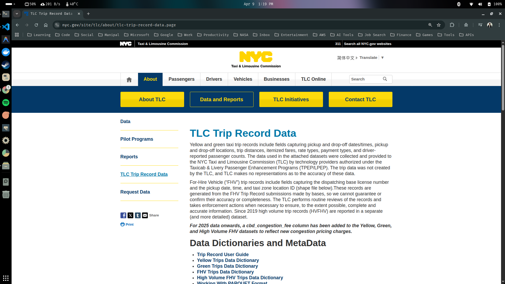
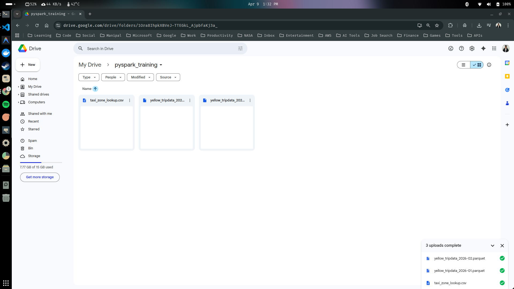

## Downloading Dataset

In this guide, we are going to download a publicly available dataset, that we can use throughout this course. 

*Let's say a data team wants insights into some rides like pickup spots, ride length, or fare amounts of New York City, which is home of the iconic yellow taxis. New Your City offers a free official dataset for this. Iys a popular choice for learning data analytics. Its big but manageable.*


1. Go to the below link that redirects you to the New York City data site.

```text
https://www.nyc.gov/site/tlc/about/tlc-trip-record-data.page
```




2. We need to download 3 files from the above website:

- First, under the heading 'Taxi Zone Maps and Lookup Tables', download the **Taxi Zone Lookup Table (CSV)**.
- Second, scroll down and expand the latest year shown (for me it's 2026).
- Download 2 data for 'Yellow Taxi Trip Records' of any month (January and Feburary).

3. Store the 3 downloaded in a single folder named 'training-data'.

```sh
siddhu@ubuntu:~/Downloads$ cd training-data/
siddhu@ubuntu:~/Downloads/training-data$ ls
taxi_zone_lookup.csv             yellow_tripdata_2026-02.parquet
yellow_tripdata_2026-01.parquet
```

4. Upload the training-data folder to your google drive, and logged into your same google account as in google colab.

```text
https://drive.google.com
```

5. Right click and create new folder named 'pyspark_training' in the drive. Then upload the 3 downloaded files inside this folder.



6. Try accesssing this files from our google colab by creating a new notebook file in google colab and running the below codes.

```python
## Cell 1

# Mount the google drive in the colab notebook as a directory
from google.colab import drive
drive.mount('/content/drive/')
```
```text
Mounted at /content/drive/
```
*You might see a popup after executing the above cell saying "Permit this notebook to access your Google Drive Files", Click the Connect to Google Drive Button and follow the steps to confirm access.*

7. Finally, lets make sure that we can really access the file from colab. Create a new code cell below and enter the following code.

```python
## Cell 2

import os
os.path.isfile('/content/drive/MyDrive/pyspark_training/yellow_tripdata_2026-01.parquet')
```
```text
True
```

*Since the output is true, the file yellow_tripdata_2026-01.parquet exists.*

> Well done, now we have a fully working colab set up that allows us to access files in google drive from our virtual environment.

---

# <div align="center">Thank You for Going Through This Guide! 🙏✨</div>